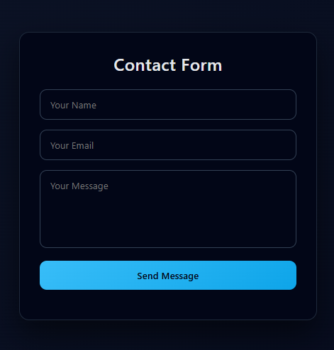
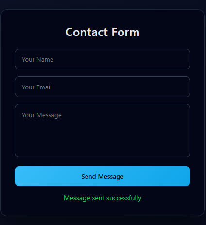
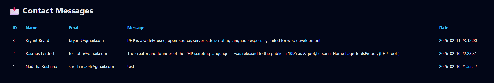

## 📸 Screenshots

### 📨 Contact Form UI
Clean and modern contact form interface for users to submit inquiries.

---

### ✅ Successful Message Submission
Confirmation message shown after successful form submission.

---

### 👑 Admin Panel – View Messages
Private admin panel to view all received contact messages in real time.

---

🔐 Security Implementation

The application implements the following security measures:

    💠 Server-side form validation

    💠 PDO prepared statements to prevent SQL injection

    💠 Session-based access control for the admin panel

    💠 Restricted direct URL access to admin routes

Note: This project uses demo credentials for development purposes.
In production, password hashing and database-stored user authentication are recommended.